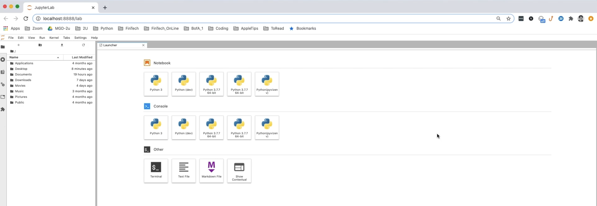

# Financial Planning Tools

As the lead developer of a fintech consulting firm specializing in community projects, we are proud to announce that we have secured a contract with a credit union to develop a comprehensive financial health assessment tool for their members. The tool will enable credit union members to evaluate their monthly budgets, as well as forecast their retirement plan based on their cryptocurrency, stock, and bond holdings.

In addition to this, we will be developing two more tools: a financial planner for emergency savings and a retirement planner. The emergency savings planner will allow members to visualize their current savings and determine if they have enough reserves to cover unexpected expenses. The retirement planner will use Monte Carlo simulations with historical price data obtained from an Alpaca API call via the Alpaca SDK to forecast portfolio performance in 30 years.

To demonstrate the capabilities of our tools, we will create a prototype application for the credit union's next assembly. Our aim is to provide value to credit union members and showcase our capabilities in the field of fintech consulting. We are excited to take on this project and look forward to working closely with the credit union to help their members achieve financial success.

---

## Technologies

This project leverages jupyter lab and python 3.7 with the following packages:

* [pandas](https://github.com/google/python-fire) - For the command line interface, help page, and entrypoint.

* [numpy](https://numpy.org/install/) - For performing mathimatical equations.

* [requests](https://github.com/psf/requests) - allows you to send HTTP requests using Python.

* [JSON](https://pypi.org/project/jsonlib/) - This library puts the response (that is, the data) from an API into a human-readable format.

* [pathlib](https://docs.python.org/3/library/pathlib.html) - Provised method to interact with the filesystem.

* [matplotlib](https://matplotlib.org/stable/users/installing/index.html) - For creating static, animated, and intractive visualizations.

---

## Installation Guide

To use the  program you will utilize the following tools for accessing APIs:

```python
  conda install pandas
  pip install numpy
  pip install pathlib
  conda install -c anaconda requests
  conda install -c jmcmurray json
  pip install python-dotenv
  pip install alpaca-trade-api
  python -m pip install -U pip
  python -m pip install -U matplotlib
```

---

## Usage

To use the  program you will utilize the following tools for accessing APIs:


[Free Crypto API](https://alternative.me/crypto/api/) 

[Nasdaq Data Link API](https://data.nasdaq.com/) 

[Alpaca API](https://alpaca.markets/) 

---

Upon launching the Financial Planning application you will be greeted with the following prompts.



---

## Contributors

Brought to you by Rosalinda Olvera Fernandez and instructor Firas Obeid.

---

## License

Available to anyone
